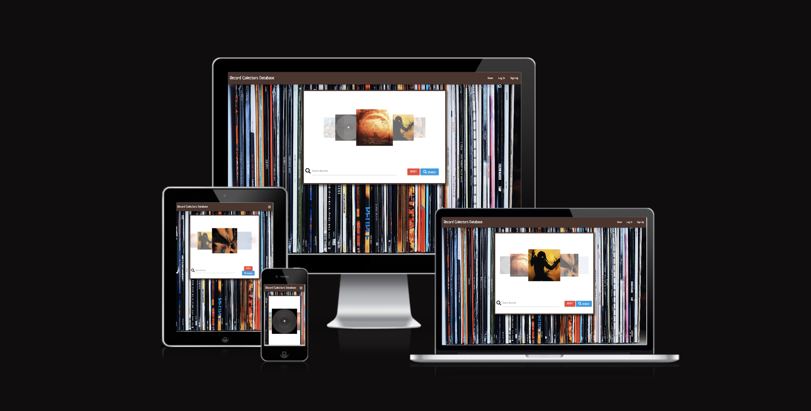
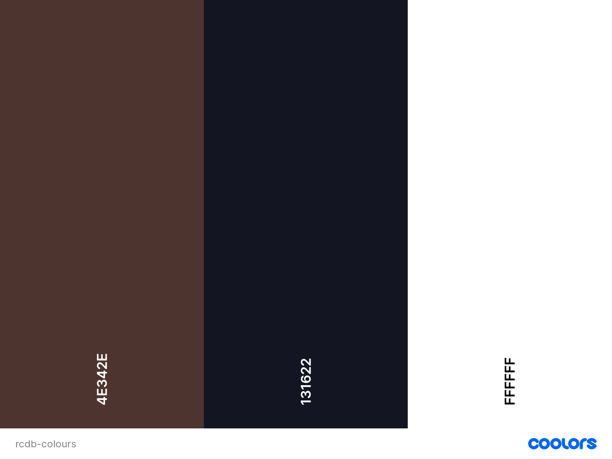
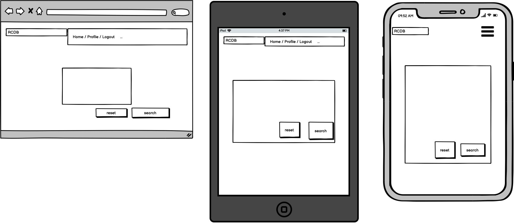
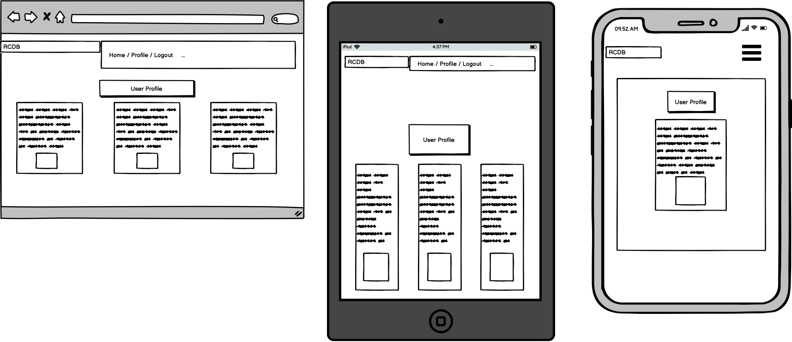
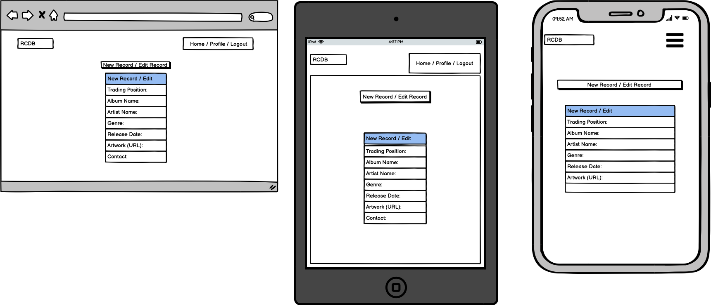
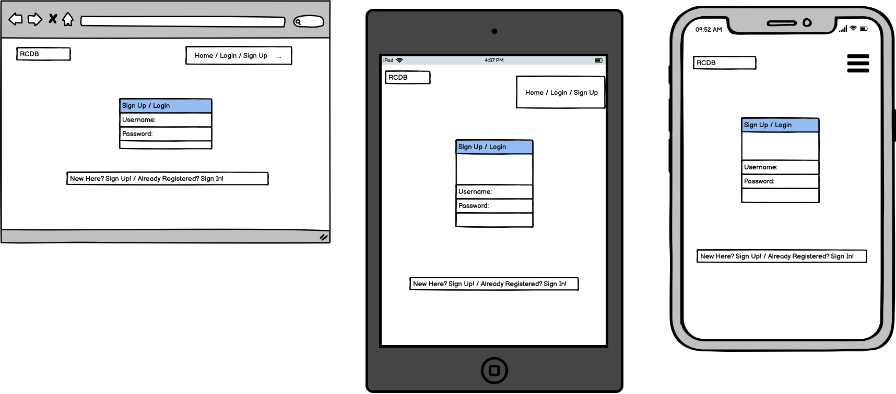

# RECORD COLLECTORS DB

The Record Collectors Database, is an application for vinyl collectors to organise their wishlist of records. Collectors are able to sign-up, and make lists of all the records they are hunting for, or advertise records they are looking to sell. 

As well as allow users to organise their own wishlists, it will to allow the user to communally explore the wishlists and advertisements of other users to create a 'marketplace' feel to the application.  

https://ui.dev/amiresponsive?url=https://record-collection-project.herokuapp.com





## UX

The central background image of the site is an image of a well-worn collection of records. This should provide a familiarity to the user as it emulates the process of being in a record shop, flipping through sleeves. 

The central background image is enclosed between light brown headers and footers, this is designed to give the feel of a shelf, also aiming at creating familiarity for the user. 

The Home page is laid out around a central carousel, that allows users to flick through entries. 

The profile page is laid out withe users individual collection in three columns. 


### Colour Scheme


- `#FFFFFFF` used for primary text.
- `#4E342E` used for main background. 
- `#131622` used for secondary text.

I used [coolors.co](https://coolors.co/e84610-009fe3-4a4a4f-445261-d63649-e6ecf0-000000) to generate my colour palette.

The site primarily uses three simple colours: Brown for backgrounds, white for main text and text backgrounds, black for secondary text. As the site feautures a main background image of a record collection, this naturally features colour organically from the sleeves, complimenting the minimal useage throughout the site. 




### Typography


- [Neucha](https://fonts.google.com/specimen/Neucha) was used for the primary headers and titles.

- [Font Awesome](https://fontawesome.com) icons were used throughout the site, such as the social media icons in the footer.

## User Stories

### New Site Users

- As a new site user, I would like to explore all users entries, so that I can gain inspiration and insight into peoples collections.
- As a new site user, I would like to create a personalised account, so that I can personalise my record collection.
- As a new site user, I would like to add new records to my profile, so that I can keep my profile up to date with new purchases or sales I would like to make.
- As a new site user, I would like to record important features of each item, such as 'genre' and 'price', so that I can create a comprehensive picture of the records I'm exploring.

### Returning Site Users

- As a returning site user, I would like to log in and out of my account, so that I can ensure only I have access to editing the records I have added.
- As a returning site user, I would like to update a record, so that I can keep up to do date with changes, such as the price.
- As a returning site user, I would like to delete a record, so that I can remove records I may have bought, sold, or no longer want.

### Site Admin

- As a site administrator, I should be able to view all the entries created on the database, so that I can analyse and understand the data.
- As a site administrator, I would like the site to be visually appealing on any device. 
- As a site administrator, I should be able to edit the data directly from the database.


## Wireframes

To follow best practice, wireframes were developed for mobile, tablet, and desktop sizes.
I've used [Balsamiq](https://balsamiq.com/wireframes) to design my site wireframes.

### Home Page Wireframes




### Profile Page Wireframes


 

### New Record / Edit Record Wireframes


 

### Verification Wireframes




## Features

### Existing Features

- **Sign-Up**

    - The 'Sign-Up' feature is the spine of the application, allowing users to create an account to begin adding records to their collection.


- **Log-In/Log-Out**

    - The log-in/log-out feature allows users to enter and exit the application and their data securely. 


- **Navbar**

    - The navbar allows users to navigate the site, access their profile, add new data, and securely in and out. On smaller screens, this becomes a sidenav, to provide clearer UX. 


- **Carousel**

    - The carousel is the main feature of the site. This feature allows users to flick through other users entries to the database, displaying the various artworks,which displays the album name when hovered over. When this is clicked, it triggers a modal that brings up the data associated with that album, allowing the user to gather the information they need. The carousel section features a search bar, allowing users to search by album or artist name. 


- **Profile-page**

    - The profile page, allows users to organise and view their own collections, including the artwork of each record. It allows users to edit and delete from their own collections.


### Future Features


- User Messaging
    - In place of displaying user contact details, a messaging feature would allow users to liase on purchasing or selling items from their collections. 
- Cool new feature #2
    - Any additional notes about this feature.
- Cool new feature #3
    - Any additional notes about this feature.

## Tools & Technologies Used

- [HTML](https://en.wikipedia.org/wiki/HTML) used for the main site content.
- [CSS](https://en.wikipedia.org/wiki/CSS) used for the main site design and layout.
- [CSS :root variables](https://www.w3schools.com/css/css3_variables.asp) used for reusable styles throughout the site.
- [CSS Flexbox](https://www.w3schools.com/css/css3_flexbox.asp) and/or [CSS Grid](https://www.w3schools.com/css/css_grid.asp) used for an enhanced responsive layout.
- [Materialize](https://materializecss.com) used as the front-end CSS framework for modern responsiveness and pre-built components.
- [JavaScript](https://www.javascript.com) used for user interaction on the site.
- [Python](https://www.python.org) used as the back-end programming language.
- [Git](https://git-scm.com) used for version control. (`git add`, `git commit`, `git push`)
- [GitHub](https://github.com) used for secure online code storage.
- [GitHub Pages](https://pages.github.com) used for hosting the deployed front-end site.
- [Gitpod](https://gitpod.io) used as a cloud-based IDE for development.
- [Markdown Builder by Tim Nelson](https://traveltimn.github.io/markdown-builder) used to help generate the Markdown files.
- [Flask](https://flask.palletsprojects.com) used as the Python framework for the site.
- [MongoDB](https://www.mongodb.com) used as the non-relational database management with Flask.
- [Heroku](https://www.heroku.com) used for hosting the deployed back-end site.


## Database Design

My project uses a non-relational database with MongoDB, and therefore the database architecture
doesn't have actual relationships like a relational database would.

My database is called **record_collection**.

It contains 4 collections:


- **records**
    | Key | Type | Notes |
    | --- | --- | --- |
    | _id | ObjectId() | |
    | trading_position | String | selected from the *trading* collection |
    | album_name | String | |
    | artist_name | String | |
    | genre | String | selected from the *genres* collection |
    | release_date | String | |
    | price | String | |
    | contact | String | |
    | image | String | Users provide a URL |
    | user | String | selected from the *users* collection |

- **genre**
    | Key | Type | Notes |
    | --- | --- | --- |
    | _id | ObjectId() | |
    | genre| String | |

- **trading**
    | Key | Type | Notes |
    | --- | --- | --- |
    | _id | ObjectId() | |
    | trading_position | String | |

- **users**
    | Key | Type | Notes |
    | --- | --- | --- |
    | _id | ObjectId() | |
    | username | String | |
    | password | String | uses Secure Hash Algorithm (SHA) |

## Testing

For all testing, please refer to the [TESTING.md](TESTING.md) file.

## Deployment

The live deployed application can be found deployed on [Heroku](https://record-collection-project.herokuapp.com).

### MongoDB Non-Relational Database 

This project uses [MongoDB](https://www.mongodb.com) for the Non-Relational Database.

To obtain your own MongoDB Database URI, sign-up on their site, then follow these steps:
- The name of the database on MongoDB should be called **insert-your-database-name-here**.
- The collection(s) needed for this database should be **insert-your-collection-names-here**.
- Click on the **Cluster** name created for the project.
- Click on the **Connect** button.
- Click **Connect Your Application**.
- Copy the connection string, and replace `password` with your own password (also remove the angle-brackets).

### Heroku Deployment

This project uses [Heroku](https://www.heroku.com), a platform as a service (PaaS) that enables developers to build, run, and operate applications entirely in the cloud.

Deployment steps are as follows, after account setup:

- Select **New** in the top-right corner of your Heroku Dashboard, and select **Create new app** from the dropdown menu.
- Your app name must be unique, and then choose a region closest to you (EU or USA), and finally, select **Create App**.
- From the new app **Settings**, click **Reveal Config Vars**, and set your environment variables.

| Key | Value |
| --- | --- |
| `DATABASE_URL` | user's own value |
| `IP` | 0.0.0.0 |
| `MONGO_DBNAME` | user's own value |
| `MONGO_URI` | user's own value |
| `PORT` | 5000 |
| `SECRET_KEY` | user's own value |

Heroku needs two additional files in order to deploy properly.
- requirements.txt
- Procfile

You can install this project's **requirements** (where applicable) using:
- `pip3 install -r requirements.txt`

If you have your own packages that have been installed, then the requirements file needs updated using:
- `pip3 freeze --local > requirements.txt`

The **Procfile** can be created with the following command:
- `echo web: python app.py > Procfile`
- *replace **app.py** with the name of your primary Flask app name; the one at the root-level*

For Heroku deployment, follow these steps to connect your own GitHub repository to the newly created app:

Either:
- Select **Automatic Deployment** from the Heroku app.

Or:
- In the Terminal/CLI, connect to Heroku using this command: `heroku login -i`
- Set the remote for Heroku: `heroku git:remote -a app_name` (replace *app_name* with your app name)
- After performing the standard Git `add`, `commit`, and `push` to GitHub, you can now type:
	- `git push heroku main`

The project should now be connected and deployed to Heroku!

### Local Deployment

This project can be cloned or forked in order to make a local copy on your own system.

For either method, you will need to install any applicable packages found within the *requirements.txt* file.
- `pip3 install -r requirements.txt`.

If you are using SQLAlchemy for your project, you need to create a local PostgreSQL database.
In this example, the example database name is **db-name**.

```shell
workspace (branch) $ set_pg
workspace (branch) $ psql

... connection to postgres ...

postgres=# CREATE DATABASE db-name;
CREATE DATABASE
postgres=# \c db-name;
You are now connected to database "db-name" as user "foobar".
db-name=# \q
```

Once that database is created, you must migrate the database changes from your models.py file.
This example uses **app-name** for the name of the primary Flask application.

```shell
workspace (branch) $ python3

... connection to Python CLI ...

>>> from app-name import db
>>> db.create_all()
>>> exit()
```

To confirm that the database table(s) have been created, you can use the following:

```shell
workspace (branch) $ psql -d db-name

... connection to postgres ...

postgres=# \dt

	List of relations
Schema | Name | Type | Owner
-------+------+------+--------
public | blah1 | table | foobar
public | blah2 | table | foobar
public | blah3 | table | foobar

db-name=# \q
```

You will need to create a new file called `env.py` at the root-level,
and include the same environment variables listed above from the Heroku deployment steps, plus a few extras.

Sample `env.py` file:

```python
import os

os.environ.setdefault("IP", "0.0.0.0")
os.environ.setdefault("MONGO_DBNAME", "user's own value")
os.environ.setdefault("MONGO_URI", "user's own value")
os.environ.setdefault("PORT", "5000")
os.environ.setdefault("SECRET_KEY", "user's own value")

# local environment only (do not include these in production/deployment!)
os.environ.setdefault("DB_URL", "user's own value")
os.environ.setdefault("DEBUG", "True")
os.environ.setdefault("DEVELOPMENT", "True")
```

If using Flask-Migrate, make sure to include the following steps as well.

During the course of development, it became necessary to update the PostgreSQL data models.
In order to do this, [Flask-Migrate](https://flask-migrate.readthedocs.io) was used.

- `pip3 install Flask-Migrate`
- Import the newly installed package on your main `__init__.py` file:
	- `from flask_migrate import Migrate`
- Define **Migrate** in the same file after **app** and **db** are defined:
	- `migrate = Migrate(app, db)`
- Initiate the migration changes in the terminal:

```shell
workspace (branch) $ flask db init

	... generating migrations ...

workspace (branch) $ set_pg
workspace (branch) $ flask db migrate -m "Add a commit message for this migration"

	... migrating changes ...

workspace (branch) $ flask db upgrade

	... updating database ...
```

#### Cloning

You can clone the repository by following these steps:

1. Go to the [GitHub repository](https://github.com/ThomG1/record_collectors_db) 
2. Locate the Code button above the list of files and click it 
3. Select if you prefer to clone using HTTPS, SSH, or GitHub CLI and click the copy button to copy the URL to your clipboard
4. Open Git shell or Terminal
5. Change the current working directory to the one where you want the cloned directory
6. In your IDE Terminal, type the following command to clone my repository:
	- `git clone https://github.com/ThomG1/record_collectors_db.git`
7. Press Enter to create your local clone.

Alternatively, if using Gitpod, you can click below to create your own workspace using this repository.

[](https://gitpod.io/#https://github.com/ThomG1/record_collectors_db)

Please note that in order to directly open the project in Gitpod, you need to have the browser extension installed.
A tutorial on how to do that can be found [here](https://www.gitpod.io/docs/configure/user-settings/browser-extension).

#### Forking

By forking the GitHub Repository, we make a copy of the original repository on our GitHub account to view and/or make changes without affecting the original owner's repository.
You can fork this repository by using the following steps:

1. Log in to GitHub and locate the [GitHub Repository](https://github.com/ThomG1/record_collectors_db)
2. At the top of the Repository (not top of page) just above the "Settings" Button on the menu, locate the "Fork" Button.
3. Once clicked, you should now have a copy of the original repository in your own GitHub account!

## Credits

### Content


| Source | Location | Notes |
| --- | --- | --- |
| [Markdown Builder by Tim Nelson](https://traveltimn.github.io/markdown-builder) | README and TESTING | tool to help generate the Markdown files |


### Media

| Source | Location | Type | Notes |
| --- | --- | --- | --- |
| [Unsplash](https://unsplash.com/photos/5j7nQv-jaVM) | product page | image | record collection image |
| [TinyPNG](https://tinypng.com) | entire site | image | tool for image compression |
| [Phonica Records](https://www.phonicarecords.com/product/ddan-the-danger-zone-lobster-theremin-black-label/142243) | entire site | image | default artwork image |


### Acknowledgements


- I would like to thank my Code Institute mentor, [Tim Nelson](https://github.com/TravelTimN) for their support throughout the development of this project.
- I would like to thank the [Code Institute](https://codeinstitute.net) tutor team for their assistance with troubleshooting and debugging some project issues.
- I would like to thank the [Code Institute Slack community](https://code-institute-room.slack.com) for the moral support.

