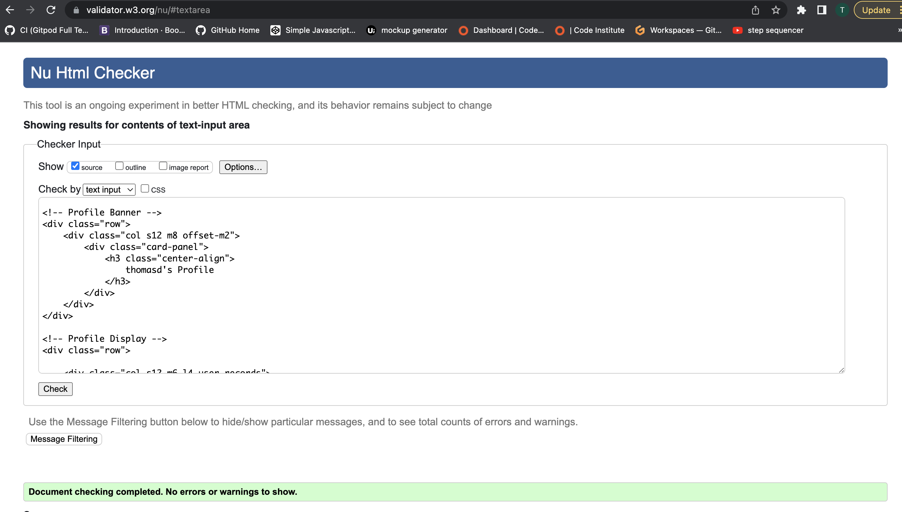

# Testing

Return back to the [README.md](README.md) file.

## Code Validation

### HTML

I have used the recommended [HTML W3C Validator](https://validator.w3.org) to validate all of my HTML files.

| Page | W3C URL | Screenshot | Notes |
| --- | --- | --- | --- |
| Home | [W3C](https://validator.w3.org/nu/?doc=https%3A%2F%2Frecord-collection-project.herokuapp.com) |  | Pass: No Errors |
| Login | [W3C](https://validator.w3.org/nu/?doc=https%3A%2F%2Frecord-collection-project.herokuapp.com%2Flogin) |  | Pass: No Errors |
| Signup | [W3C](https://validator.w3.org/nu/?doc=https%3A%2F%2Frecord-collection-project.herokuapp.com%2Fsignup) |  | Pass: No Errors |
| Profile | [W3C](https://validator.w3.org) |  | One error: This can be ignored as it relates to the default image in place |
| New Record | [W3C](https://validator.w3.org/nu/?doc=https%3A%2F%2Frecord-collection-project.herokuapp.com%2Fnew_record) |  | Pass: No Errors |
| Edit Record | [W3C](https://validator.w3.org) |  | Pass: No Errors |

### CSS

I have used the recommended [CSS Jigsaw Validator](https://jigsaw.w3.org/css-validator) to validate all of my CSS files.

| File | Jigsaw URL | Screenshot | Notes |
| --- | --- | --- | --- |
| style.css | [Jigsaw](https://jigsaw.w3.org/css-validator/validator?uri=https%3A%2F%2Frecord-collection-project.herokuapp.com%2Fget_records&profile=css3svg&usermedium=all&warning=1&vextwarning=&lang=en) |  | One Error due to materialize css |

Note: when the code is copies and pasted, it displays no errors. 

### JavaScript

I have used the recommended [JShint Validator](https://jshint.com) to validate all of my JS files.

| File | Screenshot | Notes |
| --- | --- | --- |
| script.js |  | Unused variables from external files |
| script.js |  | Unused variables from external files |

### Python

I have used the recommended [CI Python Linter](https://pep8ci.herokuapp.com) to validate all of my Python files.

| File | CI URL | Screenshot | Notes |
| --- | --- | --- | --- |
| app.py | [CI PEP8](https://pep8ci.herokuapp.com/https://raw.githubusercontent.com/ThomG1/record_collectors_db/main/app.py) |  | Pass: No Errors |

## Browser Compatibility

⚠️⚠️⚠️⚠️⚠️ START OF NOTES (to be deleted) ⚠️⚠️⚠️⚠️⚠️

Use this space to discuss testing the live/deployed site on various browsers.

Consider testing at least 3 different browsers, if available on your system.

Recommended browsers to consider:
- [Chrome](https://www.google.com/chrome)
- [Firefox](https://www.mozilla.org/firefox)
- [Safari](https://support.apple.com/downloads/safari)

I've tested my deployed project on multiple browsers to check for compatibility issues.

| Browser | Screenshot | Notes |
| --- | --- | --- |
| Chrome |  | Works as expected |
| Firefox |  | Works as expected |
| Safari |  | Works as expected |

## Responsiveness

I've tested my deployed project on multiple devices to check for responsiveness issues.

| Device | Screenshot | Notes |
| --- | --- | --- |
| Mobile (DevTools) |  | Works as expected |
| Tablet (DevTools) |  | Works as expected |
| Desktop |  | Works as expected |
| XL Monitor |  | Scaling starts to have minor issues |
| 4K Monitor |  | Noticeable scaling issues |
| Google Pixel 7 Pro |  | Works as expected |
| iPhone 14 |  | Works as expected |
| x | x | repeat for any other tested sizes |

## Lighthouse Audit

⚠️⚠️⚠️⚠️⚠️ START OF NOTES (to be deleted) ⚠️⚠️⚠️⚠️⚠️

Use this space to discuss testing the live/deployed site's Lighthouse Audit reports.
Avoid testing the local version (especially if developing in Gitpod), as this can have knock-on effects of performance.

If you don't have Lighthouse in your Developer Tools,
it can be added as an [extension](https://chrome.google.com/webstore/detail/lighthouse/blipmdconlkpinefehnmjammfjpmpbjk).

Don't just test the home page (unless it's a single-page application).
Make sure to test the Lighthouse Audit results for all of your pages.

**IMPORTANT**: You must provide screenshots of the results, to "prove" that you've actually tested them.

Sample Lighthouse testing documentation:

🛑🛑🛑🛑🛑 END OF NOTES (to be deleted) 🛑🛑🛑🛑🛑

I've tested my deployed project using the Lighthouse Audit tool to check for any major issues.

| Page | Size | Screenshot | Notes |
| --- | --- | --- | --- |
| Home | Mobile |  | Some minor warnings |
| Home | Desktop |  | Few warnings |
| About | Mobile |  | Some minor warnings |
| About | Desktop |  | Few warnings |
| Gallery | Mobile |  | Slow response time due to large images |
| Gallery | Desktop |  | Slow response time due to large images |
| x | x | x | repeat for any other tested pages/sizes |

## Defensive Programming

Defensive programming was manually tested with the below user acceptance testing:

| Page | User Action | Expected Result | Pass/Fail | Comments |
| --- | --- | --- | --- | --- |
| Home Page | | | | |
| | Click on Logo | Redirection to Home page | Pass | |
| | Click on Home link in navbar | Redirection to Home page | Pass | |
| | Click on Profile link in navbar | Redirection to Profile page | Pass | |
| | Click on New Record link in navbar | Redirection to New Record page | Pass | |
| | Click on Logout link in navbar | Redirection to Logout page | Pass | |
| | Click on Login link in navbar | Redirection to Login page | Pass | |
| | Click on Signup link in navbar | Redirection to Signup page | Pass | |
| | Hover on carousel image | Display hover effect, while retreiving album name from database | Pass | |
| | Click on carousel image | Opens modal that retrieves data from database | Pass | |
| | Scroll through carousel images | Move through different images in carousel | Pass | |
| | Enter text in search bar | Allow user to search for specific albums from database | Pass | |
| | Click search button / Press Enter | Allow user to search for specific albums from database | Pass | |
| | Reset search bar | Allow user to reset search bar | Pass | |
| Profile Page | | | | |
| | Click on edit button for each item | Redirects user to edit record page | Pass | |
| | Click on delete button for each item | Triggers confirmation modal |Pass | |
| | Click on delete button on modal| Deletes item | Pass | |
| New Record Page | | | | |
| | Select trading position | Field will accept from dropdown menu| Pass | |
| | Enter album name | Field will accept freeform text | Pass | |
| | Enter artist name | Field will accept freeform text | Pass | |
| | Select genre | Field will accept from dropdown menu | Pass | |
| | Select release date  | Field will accept from calender | Pass | |
| | Enter artwork URL | Field will accept url | Pass | |
| | Enter contact option | Field will accept freeform text, so user can choose between email / social media / phone etc | Pass | |
| | Click add new record button| Adds new record | Pass | |
| | Enter valid email address | Field will only accept email address format | Pass | |
| | Enter message in textarea | Field will accept freeform text | Pass | |
| | Click the Submit button | Redirects user to form-dump | Pass | User must click 'Back' button to return |
| Sign Up | | | | |
| | Click on Sign Up button | Redirection to Sign Up page | Pass | |
| | Enter valid email address | Field will only accept email address format | Pass | |
| | Enter valid password (twice) | Field will only accept password format | Pass | |
| | Click on Sign Up button | Asks user to confirm email page | Pass | Email sent to user |
| | Confirm email | Redirects user to blank Sign In page | Pass | |
| Log In | | | | |
| | Click on the Login link | Redirection to Login page | Pass | |
| | Enter valid email address | Field will only accept email address format | Pass | |
| | Enter valid password | Field will only accept password format | Pass | |
| | Click Login button | Redirects user to home page | Pass | |
| Log Out | | | | |
| | Click Logout button | Redirects user to logout page | Pass | Confirms logout first |
| | Click Confirm Logout button | Redirects user to home page | Pass | |
| Profile | | | | |
| | Click on Profile button | User will be redirected to the Profile page | Pass | |
| | Click on the Edit button | User will be redirected to the edit profile page | Pass | |
| | Click on the My Orders link | User will be redirected to the My Orders page | Pass | |
| | Brute forcing the URL to get to another user's profile | User should be given an error | Pass | Redirects user back to own profile |

## User Story Testing

| User Story | Screenshot |
| --- | --- |
| As a new site user, I would like to explore all users entries, so that I can gain inspiration and insight into peoples collections. |  |
| As a new site user, I would like to create a personalised account, so that I can personalise my record collection. |  |
| As a new site user, I would like to add new records to my profile, so that I can keep my profile up to date with new purchases or sales I would like to make. |  |
| As a new site user, I would like to record important features of each item, such as 'genre' and 'price', so that I can create a comprehensive picture of the records I'm exploring. |  |
| As a returning site user, I would like to log in and out of my account, so that I can ensure only I have access to editing the records I have added. |  |
| As a returning site user, I would like to update a record, so that I can keep up to do date with changes, such as the price.|  |
| As a returning site user, I would like to delete a record, so that I can remove records I may have bought, sold, or no longer want. |  |
| As a site administrator, I should be able to view all the entries created on the database, so that I can analyse and understand the data. |  |
| As a site administrator, I would like the site to be visually appealing on any device.  |  |
| As a site administrator, I should be able to edit the data directly from the database. |  |

## Bugs

There are no remaining bugs that I am aware of.
